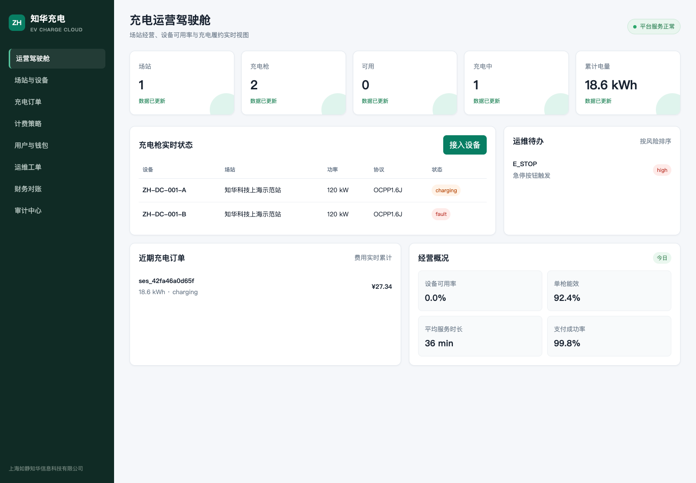
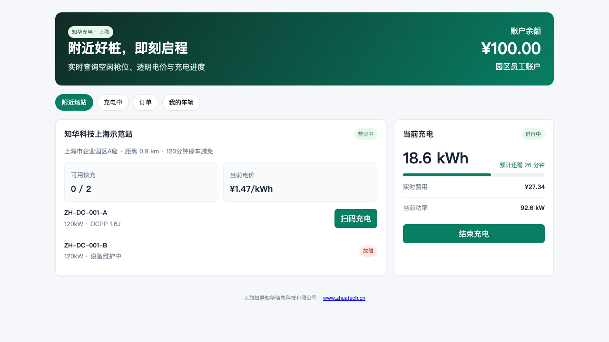

# 知华充电运营平台社区版

`zhuatech-ev-charge` 是面向园区、商业停车场、充电运营商和物业公司的新能源汽车充电运营系统。项目实现了场站建档、设备接入、预约占位、充电会话、表计采集、分时计费、钱包扣款、欠费管理、故障告警和运维工单，不是只有页面的演示外壳。

由[知华科技（上海如静知华信息科技有限公司）](https://www.zhuatech.cn/)维护。中小企业信息化、充电设备接入、商业授权或深度定制，请微信添加 `zhuatech` 或 `zhuatech2`。

| 运营管理端 | 车主用户端 |
| --- | --- |
|  |  |

## 一条完整的充电链路

```text
预约枪位 → 用户鉴权 → 启动充电 → 表计增量采集 → 分时计费
    → 停止充电 → 钱包扣款/欠费 → 枪位复位 → 财务与审计
```

故障上报会立即把充电枪切换为故障状态并生成维修工单；工单关闭且没有其他未处理故障后，设备才能恢复可用。

## 已落地的核心模块

| 模块 | 已实现功能 |
| --- | --- |
| 场站 | 编码唯一性、营业时间、地理位置、停车减免、启停状态 |
| 设备 | 充电枪接入、OCPP协议标识、功率、表底、在线与故障状态 |
| 电价 | 24小时覆盖校验、峰平谷电价、服务费、时段计费 |
| 用户 | 手机账户、预存钱包、充值、余额与欠费处理 |
| 预约 | 可用枪位预约、有效期、用户归属校验、预约核销 |
| 充电 | 幂等启动、会话状态机、表计单调校验、实时金额累计 |
| 运维 | 故障码、风险等级、责任人、工单关闭、设备自动恢复 |
| 治理 | API Key、设备令牌入口、审计事件、持久化快照和健康检查 |

## 快速体验

```bash
cp .env.example .env
npm test
CHARGE_API_KEY=zhuatech-demo-key npm start
```

- 运营中心：`http://127.0.0.1:18101/`
- 车主端：`http://127.0.0.1:18101/app`
- 健康检查：`http://127.0.0.1:18101/health`
- Docker：`docker compose up --build`

演示接口请求头为 `x-api-key: zhuatech-demo-key`。生产部署必须替换密钥，并使用网关、TLS、数据库和设备认证。

## 工程结构

```text
src/domain.js        充电交易、计费、钱包与工单领域规则
src/server.js        零依赖 HTTP API 与 JSON 快照持久化
public/              运营管理端与车主用户端
database/schema.sql  MySQL 8 生产数据模型参考
test/                Node.js 原生自动化测试
docs/                API、架构与页面图片
```

社区版默认使用 JSON 文件便于快速运行，完整 MySQL 表结构位于 `database/schema.sql`。设备协议适配器可对接 OCPP 1.6J/2.0.1，但本仓库不宣称已经兼容所有厂商硬件。

## 质量与边界

- 自动化覆盖分时计费、预约核销、幂等启动、欠费和故障恢复；
- 表计读数禁止回退，充电枪状态禁止越级流转；
- 金额在领域层统一保留两位，生产环境建议改为数据库定点小数和账本分录；
- 演示数据均为虚构，不包含真实客户、场站或支付凭证。

## 许可说明

本项目采用“知华科技社区源码许可协议（个人非商业版）”，仅允许个人学习、研究和交流，**不得商用**。企业内部生产、SaaS、项目交付、投标、实施或收费服务必须取得上海如静知华信息科技有限公司书面授权。本项目属于 source-available 社区源码，不是 OSI 定义的开源许可证项目。

## 微信咨询

| 微信号 `zhuatech` | 微信号 `zhuatech2` |
| --- | --- |
|  |  |

Copyright © 上海如静知华信息科技有限公司。
